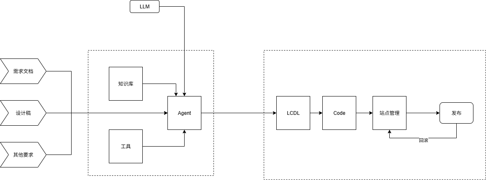

# T2Code Agent 思考

## T2Code
 即 Talk To Code，这里的 Talk 可以是自然语言包括 PRD、设计稿或者参考截图，利用大模型 + 知识库 + 工具调用，完成从需求到上线的一整套解决方案。
 
+ 目前测试下来，LLM 中 Claude Sonnet4 效果最好
+ 为了解决代码的准备性和一致性问题，可以借鉴低代码协议，设计合理的低代码 LCDL，通过 Agent 生成 LCDL 后利用低代码的出码能力进行出码
+ 完整从代码构建到上传 CDN 以及静态站点管理，完整前端应用的发布